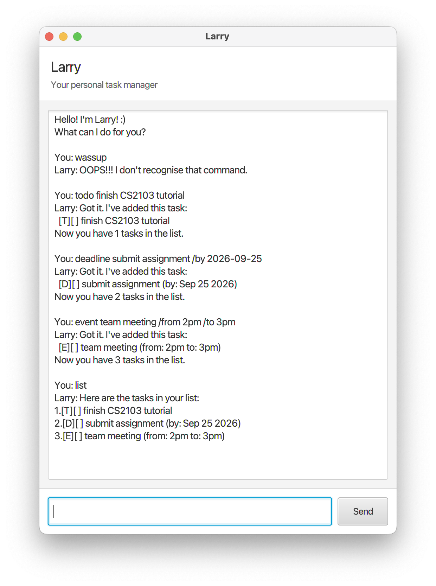

# Larry User Guide

Larry is a personal task manager that helps you keep track of todos, deadlines, and events using simple text commands.

## Quick start

Type a command into the command box and press **Enter** or click **Send**. Type `help` at any time to see the available commands.

## Viewing tasks: `list`

Shows all tasks currently in Larry.

Example: `list`

## Adding a todo: `todo`

Adds a task without a date or time.

Format: `todo <description>`

Example: `todo finish CS2103 tutorial`

## Adding a deadline: `deadline`

Adds a task that must be completed by a specified date. Dates must use the `yyyy-mm-dd` format.

Format: `deadline <description> /by <yyyy-mm-dd>`

Example: `deadline submit assignment /by 2026-09-25`

## Adding an event: `event`

Adds an event with a start and end time.

Format: `event <description> /from <start> /to <end>`

Example: `event team meeting /from 2pm /to 3pm`

## Marking a task as done: `mark`

Marks the specified task as completed. Task numbers are shown by the `list` command.

Format: `mark <task number>`

Example: `mark 1`

## Marking a task as not done: `unmark`

Marks a completed task as not done.

Format: `unmark <task number>`

Example: `unmark 1`

## Deleting a task: `delete`

Removes the specified task from Larry.

Format: `delete <task number>`

Example: `delete 2`

## Finding tasks: `find`

Shows tasks whose descriptions contain the specified keyword.

Format: `find <keyword>`

Example: `find assignment`

## Getting help: `help`

Shows the list of available commands and their expected formats.

Example: `help`

## Exiting Larry: `bye`

Ends your interaction with Larry.

Example: `bye`

## Command summary

| Command | Format |
| --- | --- |
| List tasks | `list` |
| Add todo | `todo <description>` |
| Add deadline | `deadline <description> /by <yyyy-mm-dd>` |
| Add event | `event <description> /from <start> /to <end>` |
| Mark task | `mark <task number>` |
| Unmark task | `unmark <task number>` |
| Delete task | `delete <task number>` |
| Find tasks | `find <keyword>` |
| Show help | `help` |
| Exit | `bye` |
